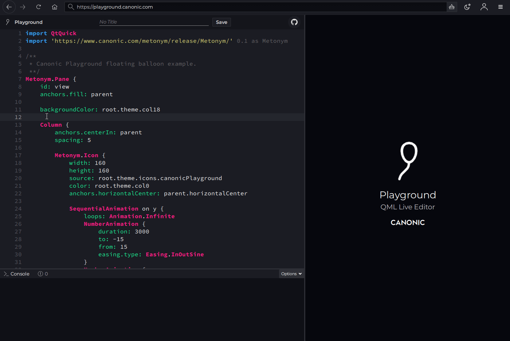

# Canonic | Playground

[Playground](https://playground.canonic.com) is a pure QML live code editor for testing and showcasing QML code snippets online. 



## Open in your Browser

Playground is designed to be used within your browser via WebAssembly using the [Canonic QML Web Browser](https://github.com/canonic/canonic).

Visit https://playground.canonic.com to give it a try.

## Features

- QML syntax highlighting
- Realtime QML hot reloading
- Within editor error indicators
- Basic QML autocomplete
- Snippet saving (unique urls + title if set)


## How to save Snippets?

Playground lets you save your snippet so that you can share it online. Simply enter an optional title and click **Save** and Playground will generate a unique url for your snippet that includes your optional title (if provided). 

For example, the following link is a QML snippet of a 3d rotating cube saved with the title __"Rotating 3D Cube example"__:
```
https://playground.canonic.com/9b07bab4-db30-4393-bd25-d29d512d176e/rotating-3d-cube-example
```
